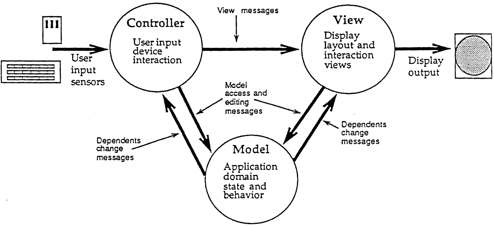

# Markdown Test Area {#sec:mdtest}

<!-- TODO -- abstract/introduction here %TODO -->

<!--

codeBlockCaptions for code-block refs?

autoSectionLabels, default false: Automatically prefix all section labels with sec:. Note that this messes with pandoc's automatic header references.

lstPrefix, default lst., lsts.: Prefix for references to lists, e.g. lsts. 2,5
-->

See [@sec:intro]. Should be same as section [-@sec:intro].

Now look again \ref{fig:thing}

{#fig:thing}

[RDF]: https://en.wikipedia.org/wiki/Resource_Description_Framework)


See RDF^[<https://en.wikipedia.org/wiki/Resource_Description_Framework> (accessed 2018/06/18)]


``` {#fig:somecode .js}
console.log("hello world");
```

see code \ref{fig:somecode}

or see \ref{fig:somecode2}

# Authorship Declaration 

Hereby I declare, that I authored this work on my own and that all sources and aids have been listed in their entirety and that all parts of the work -- including tables, maps and figures -- stemming from other works in exact wording or spirit, have been marked as quote and contain a reference to the source.

<!--
TODO Vienna, 


Ort, Datum, Unterschrift
-->

# Abstract {#sec:abstract}

<!-- 

take important point from other section

intro sentence from 02_..

check tuwien outline?

* Kontext der Arbeit / Aufgabenstellung
* Fragestellung der Diplomarbeit
* Wissenschaftliche  Methode(n)  /  Verfahrensweise(n),  mit  deren  Hilfe  die  Ergebnisse  erzielt  
* wurden
* Zentrale Ergebnisse der Arbeit

-->
This thesis is part of the over-arching Web of Needs [see ref. @Webofneeds; for related publications see ref. @WebNeedsPublications2013] project -- short WoN --
and, somewhat more particular, of developing an end-user-friendly client-application [see ref. @Match] prototype/demonstrator for it,
that allows testing the protocol and helps with communicating the WoN's potential to people.
The main focus of the work done for this thesis was to research ways of
structuring the JavaScript-based client-application; thus it consisted
of researching and experimenting with state-of-the-art web-application
architectures and tooling, adapting and innovating on them for the
particular problem space layed out in [chapter @sec:probdescr], as well as identifying a migration path for
updating the existing code-base.

As layed out in [chapter @sec:suggested-solution], we used a variant of the (ng-)redux architecture (see [@sec:redux; @sec:ng-redux] for the original architecture), but added a "messaging-agent" more akin to the runtime in the Elm-architecture (see [@sec:elm-architecture]). The action-creators, who handle non-socket network communication, use an RDF-store for caching the RDF-data used throughout the Web of Needs. To allow using newer language features and bundle the application Webpack ([@sec:webpack]) with Babel ([@sec:cross-compilation]) is used. Styling is done in SCSS ([@sec:scss]) using BEM ([@sec:TODO]) as naming convention.

<!-- 
TODO mention hevner? 
TODO drop mention of gulp and jspm?
-->


# Introduction {#sec:intro}

<!-- 

take important point from other section

intro sentence from 02_..

check tuwien outline?

-->
