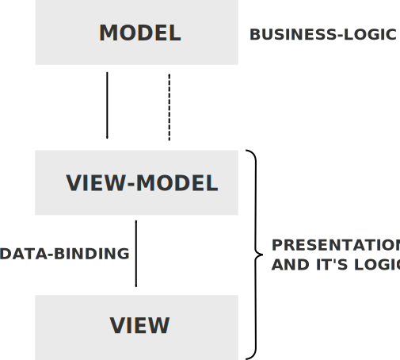
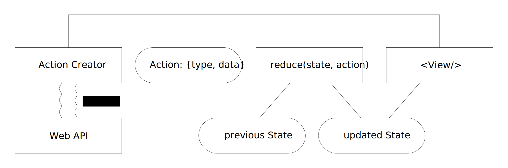

<!-- The short-comings of other solutions are somewhat a continuation of the problem description -->

<!-- * things from the knowledge-base: redux, flux, Angular, meteor, linked-data -->
<!--    * instead of in problem-description (more abstract there) -->
# State of the Art {#sec:state-of-the-art}

## Frameworks and Architecture

The following patterns all help with developing graphical user interfaces, by providing separation of concerns and decoupling. This makes it easier for multiple developers to collaborate and allows better reasoning about the app's behaviour. It also makes adapting the application easier when the understaning of the design problem changes.

The presented architectural patterns for client-side JavaScript-applications, at the time of writing encompass all widely used and sufficiently distinct I could discern during my technology- and literature research. This selection provides the reference for choosing an architecture for the Web of Needs owner application, which architecture is based off of redux ([@sec:redux]) in general and ng-redux ([@sec:ng-redux]) in particular. The reasons for this design-decision will be discussed in [section @sec:suggested-solution] "Suggested Solution".
<!--
TODO feedback @fkleedorfer ad state-of-the art: Finde den Überblick sehr gut. An der Stelle frage ich mich aber, warum ich das jetzt gelesen habe... warum wurden gerade diese Ansätze vorgestellt? Sind das alle? Sind sie irgendwie eine "Klasse" von Ansätzen?

* [ ] Verbinden zu Diskussion? (vorgreifen?)
* [ ] zusammenfassen (e.g. sind alle distinkteren und weiter verbreiteten ausprägungen, die ich gefunden habe, i.e. der state-of-the-art in meiner wahrnehmung; begründen, dass aus denen jetzt gewählt wird.
-->

<!-- TODO compare/synthesize with http://staltz.com/unidirectional-user-interface-architectures.html -->

### Model-View-Controller {#sec:mvc}

On of the, if not the most classical architectural pattern typically used in frontend-programming is Model-View-Controller. It was first introduced in the 70s at the Palo Alto Research Center [@ReenskaugThingModelViewEditor1979] and first formally published by @KrasnerCookbookUsingModelview1988. As it's still widely used and angular's MVC ([@sec:angular-mvc]) is a variant thereof it shall be shortly described here for the sake of completeness. The pattern mainly consists of three types of building blocks (as can also be seen in figure [@fig:mvc]): <!--TODO {TODO sources}-->

* **controllers** contain the lion's share of the business logic. User input gets handled by them and they get to query the model. Depending on these two information sources they decide what messages to send to the the model, i.e. the controller telling the model to change. Usually there is one controller per view and vice-versa.
* **models** hold the application's state and make sure it's consistent. If something in the data changes, it notifies views and controllers depending on it. These notifications can be parametrized, telling the dependants what changed.
* **views** are what the outside world/user's get to see. When the model changes, the view get's notified and -- depending on the data passed along and what it reads from the model -- updates accordingly.
Especially in HTML-applications, views (and thereby controllers) tend to be nested (e.g. the entire screen -- a column -- a widget in it -- a button in the widget)


Note, that there is a wide range of different interpretations of this architectural pattern, that organise models, views and controllers differently. [Section @sec:angular-mvc] describes one of these (angular 1.X' MVC) in more detail.

![MVC-architecture [@Krasnerdescriptionmodelviewcontrolleruser1988]](figures/mvc.png){#fig:mvc}

### Model-View-ViewModel {#sec:mvvm}

This architectural pattern, also known as "Model-View-Binder" is similar to MVC but puts more emphasis on the separation between back-end and front-end. Its parts are the following (see also [@fig:mvvm]):<!--TODO {TODO sources}-->

  * **The model** is the back-end business-logic and state. It can be on a different machine entirely, e.g. a web server.
  * **The view-model** contains the front-end logic and state. It is a thin binding layer, that processes inputs and that manages and provides the data required by the view.
  * **The view** is a stateless rendering of the data retrieved from the view-model; in the case of some frameworks, this happens via declarative statements in the view's templates, that automatically get updated when the data in the view-model changes. User-input events raised in the view get forwarded to the view-model.

{#fig:mvvm height=8cm}

### Angular 1.x MVC {#sec:angular-mvc}

<!--<!--TODO  {Too much detail! Move a lot of these details to later chapters (e.g. "solution » ng best practices" or "solution » why we moved from ng to ng-redux") -->

Angular 1.x is a JavaScript-framework that roughly follows the MVC/MVVM architectures, but has a few conceptual variations and extensions.

For views it uses a template-syntax. See the following snippet for an exmple from the webofneeds-codebase, that renders to an `<h2>`-header and a paragraph with a description, if the description is present (the `ng-show` is a conditional):

```html 
...
<h2 class="post-info__heading"
  ng-show="self.post.getIn([
    'won:hasContent','won:hasTextDescription'
  ])">
    Description
</h2>
<p class="post-info__details"
  ng-show="self.post.getIn([
    'won:hasContent','won:hasTextDescription'
  ])">
    {{ self.post.getIn(['won:hasContent','won:hasTextDescription']) }}
</p>
...
```

These are either specified in an HTML-file and then later linked with a controller or are a string in the declaration of something called a "directive" (which are custom HTML tags or properties). Every template has a scope object bound to it and can contain expressions -- e.g. those in curly braces -- that have access to that scope object. For the code-example in above this means, that -- in the HTML that the user gets to see -- the curly braces will have been replaced by the result of `self.post.getIn(['won:hasContent','won:hasTextDescription'])` (the `getIn` is there because `post` is an immutable-js^[https://facebook.github.io/immutable-js/] object). Practically every time the result of that expression changes, angular will update the displayed value. Basically every expression causes a "watch" to be created (this can also be done manually via `$scope.watch`). During what's called a "digest-cycle" it checks all of these watch-expressions for changes and then executes their callbacks, which in the case of the curly-braces causes the DOM-update. These digest-cycles are triggered by a lot of provided directives or if you call the function `$apply`. Some thought needs to be given to managing these to avoid imperformance and also because you can't call `$apply` while already in a digest-cycle.

Beyond the curly braces, angular also provides a handful of other template-utilities in the form of directives. For instance the property-directive `ng-repeat` allows iterating over a collection as follows:

```html
<div ng-repeat="el in collection">{{el.someVar}}</div>
```

Or, similarly, `ng-show="someBoolVar"` conditionally displays content.

Note that these template-bindings are bi-directional, i.e. the code in the template can change the the values in the model (the template's "scope"). Additionally, templates/directives can be nested within each other. By default, their scopes then use JavaScript's prototypical inheritance^[<https://developer.mozilla.org/en/docs/Web/JavaScript/Inheritance_and_the_prototype_chain>] mechanism, i.e. if a value can't be found on the template's/directive's scope, angular will then go on to try to get it from the on the one wrapping it (and so on)
This allows writing small apps or components where all data-flows are represented and all code contained in the template. For medium-sized or large apps however, the combination of bi-directional binding and scope inheritance, can lead to hard-to-follow causality, thus hard-to-track-down bugs and thus poor maintainability. More on that later. <!-- in section X -->
<!--TODO {TODO add reference to that subsection}-->
Also, using scope inheritance reduces reusability, as the respective components won't work in other contexts anymore. <!--TODO {move critique of bi-dir binding and inheritance to later chapter}-->

For all but the very smallest views/components the UI-update logic will be contained in angular's controllers, however. They are connected with their corresponding templates via the routing-configuration (more on that later <!--TODO {ref to routing-subsection}-->) or by being part of the same directive. <!--TODO {ref to directive-subsection}--> Controllers have access to their template's scope and vice versa <!--(see section X -->
<!--TODO {ref to controllerAs discussion}-->
<!--) -->
Theoretically, it's possible to reuse controllers with different templates, but this can lead to hard-to-track-down and I'd advise against doing that.
When nesting templates and thus their associated controllers, the latter form  something like a prototypical inheritance chain: If a variable isn't found on the controller, respectively its scope, the default is to check on its parent and its parent's parent, etc, up to the root-scope. Note, that scopes can be defined as isolated -- in the routing configuration for views or the individual directive's config for those -- <!--TODO {ref to routing/directive/isolated-scope section}--> to avoid this behavior, which I'd recommend for predicatability- and thus maintainability-reasons.

<!--TODO { can be reused with different template, but that rarely happens and tends to lead to hard-to-track-down bugs.}-->
<!--TODO {nesting templates (not directives?) -- how does it work anyway?}-->

<!--TODO {move controllerAs advice to later chapter}-->
<!--
Controllers have access to their template's scope via the variable `scope` that they get in their factory-function/constructor.
Alternatively, they can be bound e.g. as `self` to the scope by specifying `controllerAs: "self"` in the routing-/directive-configuration . This avoids the situation where you specify a variable on the wrong object and then the template-expression can't find it (e.g. if you miss that `this` in a bound function points to the controller-object instead of the scope) Generally speaking, using `controllerAs` makes mistakes/bugs less likely.
-->

These scopes (models), templates (views) and controllers constitute a classical MVC-architecture (see [section @sec:mvc]). However, angular also has the concept of services: Essentially, they are objects that controllers can access and that can provide utility functions, manage global application state or make HTTP requests to a web server. Controllers can't gain access to each other -- except for nesting / prototypical inheritance -- but they can always request access to any service (via dependency injection; more on
that later<!--TODO {ref to subsection}-->). Examples of services are, for instance, `$scope` that, amongst others, allows registering custom watch-expressions with angular outside of templates, like so:

```{.js #fig:ng-simple-ctrl}
var myApp = angular.module('myApp', []);
myApp.controller('PostController', function ($scope) {
  $scope.post = { text: 'heio! :)' };
  $scope.$watch('post.text', function(currentText, prevText) {
    console.log('Text has been edited: ', currentText);
  });
});
```
<!-- TODO label again
Example of a very simple controller and usage of the `$scope`-service
-->

Another example for a service would be `linkeddata-service.js` that had already been written for the first won-owner-application protototype and that is still in use. It can be used to load and cache RDF-data^[see  [section@sec:data-on-won-nodes] for more on RDF].

Considering services, it's the angular framework can also be viewed through the lense of MVVM (see [section @sec:mvvm]), with templates as views, scopes and controllers as view-models and services as models or as proxies for models on a web server (as we did with `linkeddata-service.js`).

<!-- <!--TODO { TODO get syntax-highlighting to work in figures (see comment in .tex) }-->

```{.js #fig:ng-simple-routing}
myApp.config(['$routeProvider',
  function($routeProvider) {
    $routeProvider.
      when('/landingpage?:focusSignup', {
        templateUrl: 'app/components/\
          landingpage/landingpage.html',
        controller: 'LandingpageController'
      }).
      when('/post/?postUri', {
        templateUrl: 'app/components/\
          post/post.html',
        controller: 'PostController'
      }).
      otherwise({
        redirectTo: '/landingpage'
      });
  }]);
```
<!-- TODO label again
Example of routing-configuration in Angular 1.X}
-->

<!-- todo move this to later chapters (e.g. a section on module systems) -->

Note, that Angular 1.x uses its own module system to manage directives, controllers and services. If you include all modules directly via `<script>`-tags in your `index.html`, this mechanism makes sure they're executed in the correct order. However, this also means, that if you want to combine all your scripts into one `bundle.js`[^fn:bundling]
you'll have to specify the same dependencies twice -- once for your bundling module system and once for angular's, as can be seen in the code-sample below:

[^fn:bundling]: Bundling for instance helps to reduce the number of HTTP-requests on page-load and thus its performance. It can be done by using a build-tool like browserify, webpack or jspm plus a module system like AMD, CommonJS or the standardized ES6-modules (see <http://www.ecma-international.org/ecma-262/6.0/#sec-imports>)

```{.js #fig:ng-duplicate-dependencies}
/* es6 imports for bundling */

import angular from 'angular'
import createNeedTitleBarModule from '../create-need-title-bar';
import posttypeSelectModule from '../posttype-select';

//...

class CreateNeedController { /* ... */ }

//...

/* angular module declaration */

export default angular.module(
  /* module's name: */
  'won.owner.components.createNeed',
  [ /* module's dependencies: */
    createNeedTitleBarModule,
    posttypeSelectModule,
    // ...
  ])
  .controller(
    'CreateNeedController',
    [
      '$q', '$ngRedux', '$scope', // services for ctrl
      CreateNeedController // controller factory/class
    ])
.name;
```

<!-- TODO label again
Example of module- and controller-declaration in `create-need.js`}
-->

As you can see writing applications in angular requires quite a few concepts to get started (this section only contains the essentials, you can find a full list in the angular documentation^[<https://docs.angularjs.org/guide/concepts>]. Accordingly, the learning curve is rather steep, especially if you want to use the framework well and avoid a lot of the pitfalls for beginners, that otherwise result in hard to debug and unmaintainable code.

<!--TODO {TODO reference ng docu}-->

<!--
    * [ ] super long list of concepts https://docs.angularjs.org/guide/concepts

    * [ ] views - templates + controller
	* [ ] controllers / factory methods
        * [x] somewhere between MVVM-viewmodels and MVC-controllers
		* [ ] best practice: avoid putting too much code into these
	* [x] routing
        * [x] how controllers+HTML-templates are brought together
    * [ ] directives (component style or attributes)
        * [ ] explain with example of modal?
        * [ ] preferable to view+controller as code for both + bundling of them is in one place (~react components)
    * [x] services ~MVVM-model
    * [x] arguably more mvvm than mvc
    * [x] rather steep learning curve.
        * [x] especially to use it well. there is many pitfalls for people just starting out with it to produce a code-base that is hard to maintain later on. (personal experience with smartengine-code and own code)
        * [ ] TEXT?: as concrete usage example angular solves a wide range of different problems (routing, state managment, networking, display,...) and it does so with an equally wide range of mechanisms. Redux on the other hand, has one a very small number of mechanisms, that it uses to solve all these problems similarly (e.g. routing-information is part of the redux-state)
        * [ ] TEXT: ... As you can see angular is rather complex in its architecture and contains quite a few pitfalls for the unwary newcomer. As such, it has a rather steep learning curve.
    * [x] bi-directional binding
    * [ ] auto-injection into scope via things like ng-model
    * [x] scoping / hierarchy of controllers
    * [x] scope-inheritance and its problems!
    * [ ] modules and dependency-injection
      * [x] need to include each and every JavaScript file (in the right order?). everything is loaded with quite a few HTTP-requests. can be bundled though
        * make sure to use strict mode to allow bundling
      * [ ] no tree-shaking
      * [x] redundant to es6-module system
    * [x] services
      * [x] keep global state
      * [x] wrap access utilities to server-APIs
      * [x] access to utility functions that can be injected (instead of being attached to the window)
    * [ ] controllers
      * [x] both controllers and partly models (is angular actually mvvm?)
      * [x] can be reused with different template, but that rarely happens and tends to lead to hard-to-track-down bugs.
      * [ ] mostly used at view level. below that directives provide more atomic bundling of template and code.
    * [x] templates
    * [ ] filters
      * { probably not necessary to explain }
    * [x] directives
      * [x] bundle controller and template in one file
      * [x] register custom HTML-tag (unless used in attribute, like ng-show/-class/-..., or class mode)
    * [ ] routing
      * [ ] HTML-fragments
      * [ ] ui-router (?) (are we using or have we used it?)
-->

<!-- ### Meteor  TODO { dunno if necessary? }-->

### React

React is a library that only provides the view and view-model of application architectures. It provides a mechanism to define custom components/HTML-tags (comparable to directives in Angular 1.X and webcomponents in general) as a means to achieve separation of concerns and code reusability. These components are stateful (thus the view-model) and contain their own template code, usually specified in the form of inline-HTML that is processed to calls to the React-libary (more on that
below). <!-- see $x / at the bottom of this section for an example of $y, were it written as React-component. // TODO take short directive from won-codebase and translate it to React -->
For all but the smallest applications -- where the state can be fully contained in the components -- you'll need some extra architecture in addition to React, e.g. to handle the application-state or manage HTTP-requests and websockets. Usually the code to do these things are structured using the Flux (see [section @sec:flux]) or more recently the Redux-architectures (see [section @sec:redux]).

In any way, to get to the bottom of what distinguishes React, one should first start by talking about the big problem of the Document Object Model: When there is a large number of nodes on the screen, manipulating several quickly one after each other can take quite a while, causing the whole interface to noticeably lag as every changed node causes a reflow of the layout and rerendering of the interface. React is the first of a row of libraries to use a light-weight copy of the DOM (called "Virtual DOM". The idea is to only directly manipulate the VDOM and then apply
the differential / cumulative change-set to the actual DOM in one go. This means a performance gain where multiple operations are applied to the same node or multiple nodes at the same time as React makes sure that the slow reflow and rerendering only happens once. From a development perspective, this diff'ing-process means, that there is no need to manage DOM state changes and intermediate states; the template code in the components can be written as if they were rendered completely new every cycle, i.e. only a direct
mapping from data to desired HTML needs to be provided and React handles the changes to get there.

As a notable difference to Angular, React's data-flow is unidirectional, meaning a component can read the data it gets via its HTML-tag-properties, but it can't modify them. This is a useful guarantee, to avoid bugs like when you use a component, don't know it modifies its parameter variables (intentionally or as a bug) and thus influences your unsuspecting parent component as a side-effect. Intended child-to-parent communication can be done explicitly via events published by the child (or via callback functions).

<!--
class Square extends React.Component {
  constructor() {
    super();
    this.state = {
      value: null,
    };
  }
  render() {
    return (
      <div className="square">
		{this.props.myproperty}
		{this.state.value}
      </div>
    );
  }
}
-->

### Flux {#sec:flux}


{#fig:flux_simple}

When you start reading about React you'll probably stumple across Flux (see [@fig:flux_simple]) rather earlier than later. It is the architecture popularized alongside of React and akin to MVC in that it separates handling input, updating the state and rendering the GUI.

However, instead of having bi-directional data-flow between the architectural components, Flux' is uni-directional and puts most of its business logic into the stores that manage the state. To give an example of a flow through this loop: For example, a user clicks on a map widget with the intent of picking a location. The widget's on-click method, would then create an object, called an action, that usually contains type-field like `"PICK_LOCATION"` and any other data describing the
user-interaction, such as geo-coordinates. That on-click method then goes on to pass the action object to the globally available dispatcher, which broadcasts it to all stores. Every store then decides for itself in what way it wants to update the data it holds. For instance, a `locationStore` could update the geo-coordinates it holds. The stores would then notify all components that are listening to them in particular, that their state has changed (but not in what way). The affected
components, e.g. the map and a text-label below it, poll the store for the data and render themselves anew (as if it was the first time they were doing this) -- e.g. the map would place a singular marker on the coordinates it gets from the store and the label would write out the coordinates as numbers.

Because of the last point -- the components rendering themselves "from scratch" every time, i.e. them being an (ideally) state-less mapping from app-state to HTML -- this architecture pairs well with React's VDOM.

When there is preprocessing that needs to be done on the data required for the action-object -- e.g. we want to resolve the geo-coordinates to a human-friendly address-string -- action-creators are the usual method to do so (see [@fig:flux_full]). These are functions that do preprocessing -- including HTTP-requests for instance -- and then produce the action-objects and dispach them.

Though being an architecture, i.e. a software-pattern,  per se, usually one will use one of many ready made dispatchers and also a store-prototype to inherit from, that will reduce the amount of boilerplate code necessary to bootstrap a Flux-based application.

Stores can have dependencies amongst each other. These are specified with a function along the lines of `B.waitFor(A)`, meaning that the store B only starts processing the action once A has finished doing so. Managing these dependencies in a medium-sized to large application can be quite complex, which is where Redux (see below) tries to improve over Flux.

In general, using Flux profits from using immutable data-structures for the state (e.g. those of immutable-js^[<https://facebook.github.io/immutable-js/>]). Without these, components could accidentally modify the app-state by changing fields on objects they get from the stores, thus having the potential for hard-to-track-down bugs.

{#fig:flux_full}

<!--

  * [ ] quite a learning-curve
  * [x] actions
  * [x] dispatcher
    * [x] there are many different implementations of these (the one by fb, the one by yahoo,...)
  * [x] stores
    * [x] waitFor
    * [x] dependencies between these can be hard to understand
    * [ ] lot of overhead
  * [x] views
    * [ ] most dispatchers / setups are geared to be used with redux
-->


### Redux {#sec:redux}

{#fig:redux}

The developers/designers of Redux list the object-oriented Flux- (see above) and functional Elm-architecture (see below) as prior art^[<http://redux.js.org/docs/introduction/PriorArt.html>]. Redux mainly differs from Flux in eschewing the set of stateful stores, for the Elm-like solution of having a single object as app-state, that a single reducer-function `(state, action) => state'` gets applied to for every new action, thus updating the state (see [@fig:redux]). As such there formally is also no need for a
dispatcher, as there is only a single function updating the state. However, in praxis usually a very thin utility library is used, that manages state and reducers and provides a `dispatch`-function with which the reduction can be triggered. Separation of concerns -- achieved in Flux via its larger number of stores -- can be achieved in Redux by having the reducer function call other functions, e.g. one per subobject/-tree of the state.

As the simplest implementation of this architecture consists of only a single function and a component that feeds actions into it, the learning curve is relatively flat compared to Flux and almost flat compared to Angular's MVC.

Redux profits from immutable data-structures for the app-state even more than Flux. The reducer function is supposed to be stateless and side-effect free (i.e. pure). In this particular case this means that parts of the system, that still hold references to the previous state, shouldn't be influenced by the state-update. If they want the new state, they'll get notified through their subscription. Using immutable data guarantees this side-effect freeness to some extent; nothing can
prevent any point in the code from accessing the global `window`-scope in JavaScript though -- however it's very bad practice to do so and thus should universally be avoided. This property also means that you should try to move as much busieness logic as possible to the reducer, as it's comparatively easy to reason about and thus debug. For all things that require side-effects (e.g. anything asynchronous like networking) action-creators are the go-to solution -- same as in Flux.


<!--

TODO graphic

  * [x] http://redux.js.org/
  * [x] can be super-simple (give trivial example)
  * [x] easy to learn (it's only one event-bus/dispatcher, one reduction-function)
  * [x] ideally used with immutable data for model (to avoid bugs due to pass-by-reference and later modification)
  * [x] doesn't deal with side-effects by default (see ACs and actors later)
  * [x] (action-creators (for pre-processing))
  * [x] actions
  * [x] dispatcher
  * [x] separation of concerns by having subfunctions for reducer
  * [x] reduction function
    * [x]  synchronous (can't do asynch side-effects here)
    * [x] (supposed to be) side-effect free. do as much as business logic as possible here.
 * [x] components
-->

### Ng-Redux {#sec:ng-redux}

Ng-Redux^[<https://github.com/angular-redux/ng-redux>] is a framework that is based on the Redux-architecture and is designed to be used with Angular applications. The latter handles the Components/Directives and their updates of the DOM, whereas Ng-Redux manages the application state. In this combination, the frameworks binds functions to the angular controllers to trigger any of the available actions. Even more importantly, it allows registering a `selectFromState`-function that gets run after
the app-state has been updated and the result of which is then bound to the controller. Ng-Redux also provides a middleware-system for plugins that can modify actions and state before and after a reduction step and can trigger side-effects. For example "thunk" provides a convenient way to handle asynchronicity in reducers, by passing a dispatch-function to them that they can call at any later point in time (e.g. when an HTTP request returns). Another example is the `ngUiRouterMiddleware` that allows interfacing with browsers' history-API (and thus URL in the URL-bar). That middleware also conveniently adds this information (e.g. current route and route-parameters) to the application state, where components can retrieve them like any other part of the state.

<!--

TODO example of use in a simple directive?

  * [ ] good for migrating (why we chose it)
  * [x] duplicate imports if using es6 (though not ng-redux inherent)
  * [ ] explain binding into routing, setup of watches, importance of one way bindings
  * [ ] has a dispatcher (what does it do? it should be super minimal)
-->


### Elm-Architecture

<!-- TODO diagram -->

Elm^[<http://elm-lang.org/>] is a functional language whose designers set out to create something as accessible to newcomers as Python or Javascript. It can be used to build front-end web applications. The original Elm-architecture was based on functional reactive programming -- i.e. using streams/observables like CycleJS' MVI (see below) that it inspired as well -- but they have since been removed to make it more accessible to
newcomers. The current
architecture^[https://guide.elm-lang.org/architecture/>], in its basic form, requires one to define the following three functions and then, in the main function, pass these three to one of several startup functions (e.g. `Html.beginnerProgram`):


* `model : Model`, that initializes the app-state.
* `update : Msg -> Model -> Model` is a function that takes a `Msg` and a `Model` and returns an (updated) `Model`. This function performs the same role as `reduce` in Redux, with `Msg`s in Elm being the equivalent to actions in Redux.
* And lastly, `view : Model -> Html Msg` to produce the HTML from the model. In Redux a library like react or, as is the case of the work at hand, angular would be used to do this rendering of `Model` to HTML.

As Elm is a pure (i.e. side-effect free) language, these can't handle asynchronity yet (e.g. HTTP-requests, websockets) or even just produce random numbers. The full architecture, that handles these side-effects, looks as follows (and is run via `Html.program`):

* `init : (Model, Cmd Msg)` fulfills the same role as `model`, but also defines the first `Cmd`. These commands allow _requesting_ for side-effectful computations like asynchronous operations (e.g. HTTP-requests) or random number generation. The result of the `Cmd` is fed back as `Msg` to the next `update`.
* the function `update : Msg -> Model -> (Model, Cmd Msg)`, in this variant of the architecture, also returns a `Cmd` to allow triggering messages ("actions" in redux-terms) depending on user input or the results of previous `Cmd`s. This allows keeping all of the business-logic in the `update`-function (as compared to Flux'/Redux' action-creators) but trades off the quality, that every user-input or websocket message can only trigger exactly one action and thus exactly one update (thus making endless-loops possible again) <!-- -- arguably this is a rather neglible price. <- TODO move to suggested solution / discussion section -->
* `subscriptions : Model -> Sub Msg` allows to set up additional sources for `Msg`s beside user-input, things that _push_, e.g. listening on a websocket.
* `view : Model -> Html Msg` works the same as in the simple variant.

<!--
TODO snippet / pic of previous
    * [x] previous (at time of designing)
    * [x] current
-->

### CycleJS MVI

<!-- TODO diagram -->

CycleJS is a framework based on "functional reactive programming" (short FRP). The framework's is following a Model-View-Intent architecture that is similar to the Redux- and (original) Elm-architectures.

As an FRP-based framework, it uses observables/streams of messages for its internal data-flows. These can be thought of as as Promises that can trigger multiple times, or even more abstract, as pipes that manipulate data flowing through. These observables/streams can be composed to form a larger system. The integral part developer's using the framework need to specify is a function `main(sources) => ({ DOM: htmlStream})` (see [@fig:cyclejs]) that takes a driver "`sources`" like the DOM-driver that allows creating stream-sources (e.g. click events on a button). One would then apply any data-manipulations in the function and return a stream of virtual DOM. In the very simple code-example given below, for every input-event a piece of data/a message would travel down the chained functions and end up as a virtual DOM object. This `main`-function is passed to the `run`-function to start the app.

<!-- TODO instead rewrite one of our components as example here. -->
<!-- TODO syntax highlighting -->
```{.js #fig:cyclejs}
import {run} from '@cycle/xstream-run';
import {div, label, input, hr, h1, makeDOMDriver} from '@cycle/dom';

function main(sources) {
  const sinks = {
    DOM: sources.DOM.select('.field').events('input')
      .map(ev => ev.target.value) // get text from field
      .startWith('') // initial value / first stream-message
      .map(name =>
        div([
          label('Name:'),
          input('.field', {attrs: {type: 'text'}}),
          hr(),
          h1('Hello ' + name),
        ])
      )
  };
  return sinks;
}

run(main, { DOM: makeDOMDriver('#app-container') });
```
<!-- TODO label again
CycleJS hello-world example from <https://cycle.js.org/>
-->

For more complex applications, an architecture similar to Redux/Elm, called "Model-View-Intent" is recommended. For this, the stream in `main` is split into three consecutive sections:

* **Intent**-functions that set up the input streams from event-sources (e.g. DOM and websockets) and return "intents" that are equivalent to Flux'/Redux' actions and Elm's messages.
* The **model**-stage is usually implemented as a function that is `reduce`'d over the model (equivalent to how Redux deals with state-updates)
* And lastly the **view**-stage takes the entire model and produces VDOM-messages.

Separation of concerns happens by using sub-functions or splitting the stream at each stage (or starting with several sources at the intent-stage) and combining them at the end of that respective stage. Thus at the boundary between each of the three stages all streams are unified into one stream that is connected to the next stage.

<!--
* [ ] driver's are similar to actors?
-->

<!--
TODO feedback @fkleedorfer ad state-of-the art: Finde den Überblick sehr gut. An der Stelle frage ich mich aber, warum ich das jetzt gelesen habe... warum wurden gerade diese Ansätze vorgestellt? Sind das alle? Sind sie irgendwie eine "Klasse" von Ansätzen?

* [ ] Verbinden zu Diskussion? (vorgreifen?)
* [ ] zusammenfassen (e.g. sind alle distinkteren und weiter verbreiteten ausprägungen, die ich gefunden habe, i.e. der state-of-the-art in meiner wahrnehmung; begründen, dass aus denen jetzt gewählt wird.
-->

## State-of-the Art Summary
