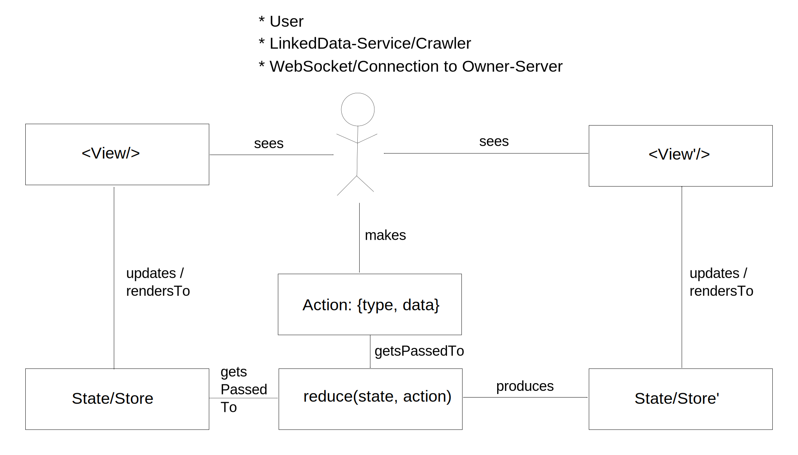

<!-- TODO for references: when using blog-posts, thematize that academic publishing is rather slow, especially as compared to the developments in the world of web technologies. -->
<!-- Meta: for claims, just start out with a TODO-marker, then if the reference actually ends up in the finished text, find a reference to support the claim. -->

# Suggested Solution {#sec:suggested-solution}

<!-- TODO RUNNING EXAMPLE -->
<!-- fkleedorfer_rsa [5:25 PM]  -->
<!-- vielleicht ein 'running example' im suggested solution teil? -->
<!-- an dem man sehen kann was man schreiben muss, um in der architektur was einzubauen -->
<!-- zb: User tippt eine message und drückt enter -->

<!-- TODO REGEAR TO COMPARISON OF TOOLS AND WHEN TO CHOOSE WHAT (for similar scenarios as ours) -->
<!-- FK: ist doch schon mal was.. vielleicht eine vergleichsmatrix oder längeres eingehen auf die gründe für die Wahl? -->

<!-- CHAPTER-OUTLINE: -->
<!-- 1. one section on tool-choices -->
<!-- 1. one section on the current architecture (how we planned it vs how it turned out, e.g. actors directly accessing state) -->
<!-- 1. one on future work:  -->
<!--     * drop actors, drop angular / look at ng2 -->
<!--     * NOTE: The Architecture fails somewhat at keeping sync state across tabs, implementing that is a lot of effort on top of it. Theoretically we could serialize and sync the entire state (making sync a lot easier than with angular and flux), but it’s still no Falcor, Relay or Meteor(?) in that regard. -->

As already mentioned in the problem description (chapter [-@sec:probdescr]), the rework and restructuring started with a codebase using Angular (see section [-@sec:angular-mvc]), all modules included one-by-one in the `index.jsp` and some bootstrap-theme (see section [@sec:bootstrap]) for styling. Bugs were hard to solve due to the "grown" code-base and the somewhat ambigous architecture stemming both the wide range of concepts in angular that required understanding and best-practices
as well as our grasp of them. Additionally, the visual style was neither polished nor projecting a unique identity.

As part of a research-project together with our partner Meinkauf, the Researchstudio Smart Agent Technologies was tasked with developing a plattform-independent mobile application and used Ionic^[<http://ionicframework.com/>], i.e. a tooling default, that at the time consisted of Phonegap^[<http://phonegap.com/>], Angular 1.x, SCSS (see section [@sec:scss]), ionic-specific CSS and it's own command-line-tool. This project presented a good opportunity to try out a different architecture, to deal with the ambiguities and maintenance problems we were experiencing with the Web of Needs owner-application. 

## Technology Stack 

<!--

* meinkauf app -> ng-redux has good DX

components:

* bi-directional binding was causing a lot of bugs (how many?) -> less angular
* migrate -> ng-redux instead of react 
* modularity -> slightly lessened by redux. reusable components shouldn't be connected to redux but gain input via properties. most components are clearly app-specific anyway.
* seperation of conerns -> all do that, redux does it with less concepts / clearer imo
* redux reduces problems with asynchronity (the actions make app behaviour predictable / understandable / replayable -- tbh, the same would go for events on the angular root) 
* angular has problems with triggering events while a dispatch is in progress (we had problems with endless loops a few times (TODO link))

* Migration:
  * started off with ng-app
  * meinkauf app as test-field
  * Reducing bootstrap usage.
  * Promises: $q to native.
  * started with router and core reducers(?)
  * a lot of mocking → smooth collaboration
  * how did we migrate, step-by-step (central redux architecture first, then add components, write import wrapper for won.js, restructure linkeddata-service.js)

build tool: pure npm vs grunt vs gulp vs brunch?

* too complex for chaining commands in npm (<- is it really?)
* gulp seemed to be best practice with it's pipes (with grunt being too old and brunch not well known)
* TODO better arguments

dependency mngmt - npm vs bower vs jspm vs yarn: 

* not all packages on npm
* bower has many gui packages but no perceivable advantage beyond that and makes the build more complex
* jspm also integrates packaging and crosscompiling and can do npm, bower and github as source
* yarn beats npm for speed and predictability but can only do npm as source (afair)

why bundle at all: no endless include lists in index.jsp anymore
module syntax - amd/requirejs/commonjs vs es6: es6 is the standardized way
bundling - browserify vs webpack vs jspm: 

css-preprocessor - less vs sass: more people (TODO numbers) and better tooling for sass. both have similiar functionality

css framework: we also switched away from bootstrap, as we'd need to modify it’s styles that heavily anyway

css code-styling - oocs vs bem: we're not trying to develop a generic style atm (though we probably could have developed against the bootstrap/semcss/tachyon list of classes). bem avoids name-clashes (due to css' global name-space) and has a focus on components. however, turns out that oocss seems to more reusable and easy to learn (link to sources of pro-oocss article)


    


## Research Rigor
"Design-science research relies upon the application of rigorous methods in both the construction and evaluation of the design artifact."
<!-- This means applying existing foundations and methodologies, using effective metrics and formalising. Note, however, that an overemphasis on rigor can often lead to lower relevance (Lee 1999), as many environments and artifacts defy an excessive formalism (see "wicked problems" at footnote [^fn:wicked]). <!--TODO better reference / use glossary entry --> -->

requirements:

• Create and post new needs. Currently these consist of a simple data-structure with a subject, textual description and optional tags or location information.
• View needs and all data in them in a human-friendly fashion
• Share links to posts with other people
• Immediately get notified of and see matches, incoming requests and chat messages
• Send and accept contact/connection requests
• Write and send chat messages

• good DX (TODO define)
• Needs to be able to keep data in sync between browser-tabs running the JS-client and the Java-based server. This happens through a REST-API and websockets.  Most messages arrive at the WoN-Owner-Server from the WoN-Node and just get forwarded to the client via the websocket. The only data directly stored on and fetched from the Owner-Server are the account details, which needs belong to an account, its key-pair and information on which events have been seen.
• As subject of a research-project, the protocols can change at any time. Doing so
should only cause minimal refactoring in the owner-application.
• In the future different means of interactions between needs – i.e. types need-to-need connections – will be added. Doing so should only cause minimal changes in the application.
• Ultimately the interface for authoring needs should support a wide range of ontolo- gies respectively any ontology people might want to use for descriptions. Adapting the authoring guys or even just adding a few form input widgets should be seamless and only require a few local changes.
• We didn’t want to deal with the additional hurdles/constraints of designing the prototype for mobile-screens at first, but a later adaption/port was to be expected.  Changing the client application for that should require minimal effort.


## Process

<!--
Flo: "I think it's interesting to describe the actual process, but you should not over-emphasize it. In the end, you came up with a design and an implementation, and that is the artifact you produced.

If you can show multiple iterations of your artifact with 'experiments' evaluating its appropriateness and refinements, fine - but don't zoom into the microscopic level (first I read this, then that, ...).

"

**argument:** feasibility wasn't clear to begin with!!! -> it's research

-->

1. peacemems notifies me of react
2. reading that, i also stumbled across flux
  * flux-article talks about problems with angular/bi-directional data-bindings resonates (same problems when debugging prev prototype) (?)
3. meinkauf app -> design by ulf(?), testing ionic (for mobile) and ng-redux. DX is good (TODO define DX)
4. new ulf screens for won-app → we’ll need to rewrite (?)
4. rewriting with the old angular setup (angular 2 isn’t production ready)
4. pre-compilation (js, scss) and bundling setup
  * we also switched away from bootstrap, as we'd need to modify it’s styles that heavily anyway
4. actually: when stores and synching via the ws became a thing, started researching flux, ended up stumbling across redux (#342)
  * apparently, we were using flux even before that (see #342). it’s part of a commit from 23 Sep 2015 (1395ba6) and was only used to test with a draft store, so nvm.
  * and compared different implementations ( 	b824aa2)
6. read up on redux and ways to integrate with existing code-base
7. implementation
  * Frankangular - the Migration Process. Reducing angular to a rendering stage.
  * Frankangular - Duplicate imports :{
  * Migration:
      * Reducing bootstrap usage.
      * Promises: $q to native.
   * started with router and core reducers(?)
   * a lot of mocking → smooth collaboration
8. usability tests (?) not really part of architecture

* Meta: möglichst so, dass ich nichts mehr machen soll
* Meta: Write in a way that large parts can be used as WoN-documentation(?)
* Meta: always spell in full first names of female authors for references
* Meta: repeat important points with different wordings.

“iteratively identifying deficiencies in prototypes and creatively developing solutions to address them” (Markus et al., 2002)

medium.js text field

rdfstore-js:

* use it for caching but not as redux store
* accessing it is asynch (reducers are synchronous)
* not all app data is described in rdf

compare with other architectures (angular 1.X, flux, cyclejs’ mvi, elm,...)

how did co-workers deal with it? ease of use?

interaction/integration with project mngmt workflows. e.g. pull-requests, mocking,...

more difficult architectural decisions:

* Routing
* Rdf-store
* Access Management


## Relevant Github-Issues

* [Owner App README](https://github.com/researchstudio-sat/webofneeds/tree/master/webofneeds/won-owner-webapp) basically describes our redux setup
* [The New Code Base Structure - Structure Diagrams, Refactoring and more](https://github.com/researchstudio-sat/webofneeds/issues/151) (#151)
* [Map widget](https://github.com/researchstudio-sat/webofneeds/issues/222)  (#222) and [marker clustering](https://github.com/researchstudio-sat/webofneeds/issues/227) (#227)
  * leafletjs and osm
* [Address forms](https://github.com/researchstudio-sat/webofneeds/issues/226) (#226)
* [Password-retyping unnecessary if reset-via-email works](https://github.com/researchstudio-sat/webofneeds/issues/264) (#264)
* Experiences with contenteditable ([#278](https://github.com/researchstudio-sat/webofneeds/issues/278))
* [Angular 2.0](https://github.com/researchstudio-sat/webofneeds/issues/300) (#300)
* [Precompilation and Tooling (Bundling, CSS, ES6)](https://github.com/researchstudio-sat/webofneeds/issues/314) (#314)
  * bundling, svg sprites, sass, es6,...  - why and how?
  * SASS and BEM. Also address Semantic CSS (!)
* [SVG-sprites](https://github.com/researchstudio-sat/webofneeds/issues/318) (#318)
* [Template Parsing Performance](https://github.com/researchstudio-sat/webofneeds/issues/319) (#319) - jsx
* [Speech-Bubble-CSS](https://github.com/researchstudio-sat/webofneeds/issues/333) (#333)
  * Afair we now use a better version by simply rotating a div with a border.
* [Documentation-generator](https://github.com/researchstudio-sat/webofneeds/issues/337) (#337)
* [Actions/Stores and Synching ](https://github.com/researchstudio-sat/webofneeds/issues/342) (#342)
  * meta: figures in issue need updates
  * this is the issue that triggered the redux research.
  * Redux ~ Elm Architecture ~ CycleJS Model-View-Intent. The parts (Action-Creators / Actions, Reducers, Views). Insights on handling side-effects (e.g. server-side interaction)
  * dealing with rdf-store
* [Routing and Redux](https://github.com/researchstudio-sat/webofneeds/issues/344) (#344)
* [chrome’s security](https://github.com/researchstudio-sat/webofneeds/issues/372) (#372)
* [WebSocket only created before login](https://github.com/researchstudio-sat/webofneeds/issues/381) (#381)
* [Direct link to need](https://github.com/researchstudio-sat/webofneeds/issues/517).
* [nicer urls via html5mode in ui-router](https://github.com/researchstudio-sat/webofneeds/issues/520) (#520)
* [Speed up build](https://github.com/researchstudio-sat/webofneeds/issues/577) (#577) aka "`jspm install` is slow when you need to run it on every build"
* [Page-load performance optimisation](https://github.com/researchstudio-sat/webofneeds/issues/546) (#546)
* [Human-friendly timestamps ](https://github.com/researchstudio-sat/webofneeds/issues/549) (#549) → tick actions
* [Load data selectively](https://github.com/researchstudio-sat/webofneeds/issues/623) (#623) – Paging
* [Flatten content-node of needs](https://github.com/researchstudio-sat/webofneeds/issues/719) (#719)
* [direct link to conversation not working](https://github.com/researchstudio-sat/webofneeds/issues/728) (#728)
* Unify Directives: Overview » Incoming Requests and Matches List
* Unify Directives: Chat and Incoming Request and Outgoing Request
* [Usability Tests of Demonstrator](https://github.com/researchstudio-sat/webofneeds/issues/752) (#752)

-->

## Architecture {#architecture}

<!--TODO {Reword so it fits into the thesis. Change all links to github issues
to point to other sections of the thesis.}-->
<!--TODO {describe why other architectures weren't used, i.e. mehr bezug zu state-of-the-art}-->

<!--<!--TODO  {describe why other architectures weren't used, i.e. mehr bezug zu state-of-the-art}--> -->
<!-- * (angular-)mvc:  -->
<!-- * mvvm -->
<!-- * react -->
<!-- * flux -->
<!-- * elm-architecture: would require vdom (actually how flux/redux should look like. in angular we can't do `view : Model -> Html Msg`). purity of elm would be nice :3 -->
<!-- * cyclejs mvi -->

<!-- tbh, any of these architectures can solve the technical requirements -->
<!-- crux is additional technical requirements: -->
<!-- * clear causality: -->
<!-- * minimize side-effects: -->
<!-- * seperated responsibilities: -->
<!-- * transparent system state: -->
<!--   * (angular-)mvc: seperated state. a lot also held in controllers and views/components (bad design, but temptation is there to quickly fix a problem). actually, the previous app didn't have a proper model at all (except for the data fetched from the server(s)). We hadn't yet figured out responsibilities and were just solving problems as they appeared wherever they appeared (i.e. often-times directly in the components) -->
<!--   * mvvm:  -->
<!--   * react: seperated state -->
<!--   * flux -->
<!--   * elm-architecture:  -->
<!--   * cyclejs mvi -->
<!-- * vs weakly typed: -->
<!--   * with redux a lot of bugs theoretically should be detectable already in the reducer. however in-practice they're written pretty lenient, to allow the app to gracefully degrade when data is missing. On the plus side, as long as there's no code-duplication, any debugging should maximally require looking three files (an action-creator, a reducer, a component) (and any subroutines of these) -->


We're using a variation of the (ng-)redux-architecture (see sections [-@sec:redux] and [-@sec:ng-redux] respectively) for the won-owner-webapp javascript-client.

This section will document in what ways our architecture diverges from or
builds on top of basic (ng-)redux, as well as list experiences and
style-recommendations derived from using it. <!--TODO these latter points should be in the critical reflection section -->

{#fig:adapted-redux}

### Action Creators {#sct:action-creators}

Can be found in `app/actions/actions.js` <!-- TODO put into apendix -->

Anything that can cause **side-effects** or is
**asynchronous** should happen in these (tough they can also
be synchronous -- see `INJ_DEFAULT`) <!--TODO code snippet -->
They should only be triggered
by either the user or a push from the server via the
`messagingAgent.js`. In both cases they cause a
**single**(!) action to be dispatched and thus passed as
input to the reducer-function.

If you want to **add new action-creators** do so by adding to the
`actionHierarchy`-object in `actions.js`. <!-- TODO reword. this thesis isn't for colleagues working on the same code-base -->
From that two objects are generated at the moment:

* `actionTypes`, which contains string-constants (e.g.  `actionTypes.drafts.change.title === 'drafts.change.title'`)
* `actionCreators`, which houses the action creators. For the sake of injecting them with ng-redux, they are organised with `__` as seperator (e.g.
* `actionCreators.drafts__change__title('some title')`

The easiest way to create actions without sideffects is to just place
an `myAction: INJ_DEFAULT`. This results in an action-creator
that just dispatches all function-arguments as payload, i.e.
`actionCreators.myAction = argument => ({type: 'myAction', payload: argument})`

Actions and their creators should always be describe 
**high-level user stories/interactions** like 
`matches.receivedNew` or `publishPost`
(as opposed to something like `matches.add`
or `data.set`)
Action-creators
encapsule all sideeffectful computation, as opposed to the reducers
which (within the limits of javascript) are guaranteed to be
side-effect-free. Thus we should do 
**as much as possible within the reducers**. 
This decreases the suprise-factor/coupling/bug-proneness
of our code and increases its maintainability.

### Actions {#actions}

They are objects that serve as input for the reducer. Usually they 
consist of a type and a payload, e.g.:

```js
{
  type: "needs.close"
  payload: {
    ownNeedUri: "https://node.matchat.org/won/resource/need/1234"
  }
}
```

These should describe high-level interactions from the user (or 
server if initiated there).  
A full list of action-types, used in the owner-application  
can be found in `app/actions/actions.js`.  <!-- TODO put into appendix -->

<!-- See:  -->
<!-- \href{https://github.com/researchstudio-sat/webofneeds/issues/342}{Actions/Stores -->
<!-- and Synching} <!--TODO should be in-thesis ref-->

### Reducers {#reducers}

Can be found in `app/reducers/reducers.js` <!-- TODO put into appendix -->

These are **side-effect-free**. Thus as much of the implementation
as possible should be here instead of in the action-creators
to profit from this guarantee and steer clear of possible sources for
bugs that are hard to track down.

Usually they will consist of simple switch-case statements. A simple
reducer that would keep track of own needs could (in-part) look as 
follows:

```js
import { actionTypes } from '../actions/actions';
import Immutable from 'immutable';
import won from '../won-es6';

const initialState = Immutable.fromJS({
    //...
    ownNeeds: {},
});

export default function(allNeeds = initialState, action = {}) {
  switch(action.type) {
    case actionTypes.logout:
      return initialState;

    case actionTypes.needs.close:
      return allNeeds.setIn([
        "ownNeeds", action.payload.ownNeedUri, 'won:isInState'
      ], won.WON.InactiveCompacted);

    //...

    default:
      return allNeeds;
}
```


### Components {#components}

They live in `app/components/`. <!-- TODO put into appendix? -->

Top-level components (views in the angular-sense) have their own folders
(e.g. `app/components/create-need/` and are split in two files).
You'll need to add them to the routing (see below) to be able to switch
the routing-state to these.

Non-top-level components are implemented as directives. A very simple 
demo-component, that would render the title and description of a need to
the DOM-tree and allow closing it  (i.e. making it unreachable to contact
requests) via a click on "[CLOSE]", would look as follows:

```js
import angular from 'angular';
import 'ng-redux';
import { actionCreators }  from '../actions/actions';
import { attach } from '../utils.js'
import { seeksOrIs, connect2Redux } from '../won-utils'

// angular utilities required to integrate the component
// into the redux architecture via the `connect2Redux`-
// function.
const serviceDependencies = ['$ngRedux', '$scope'];

// factory function for the directive:
function genComponentConf() {

  let template = `
  	<h1>{{ self.needContent.get('dc:title') }} [DEMO]</h1>
  	<p>{{ self.needContent.get('won:hasTextDescription') }}</p>
  	<a ng-click="self.needs__close(self.need.get('@id'))">
        [CLOSE]
    </a>
  `;

  class Controller {
    constructor() {

      // does `controller.<serviceName> = <serviceName>`
      // for all services injected via `arguments` 
      attach(this, serviceDependencies, arguments);

      const selectFromState = (state) => {
        const need =
          state.getIn(['needs', 'ownNeeds', this.needUri]); 

        // need and needContent will be bound to the 
        // controller (=scope) and thus be available
        // in the template.
        return { 
          need,
          needContent: need && seeksOrIs(need),
        }
      };
      connect2Redux(
        selectFromState, // result will be bound to `this` 
        actionCreators, // will be bound to `this`
        ['self.needUri'], // component property used in select
        this // the controller
      );
    }
  }
  Controller.$inject = serviceDependencies;

  // directive configuration:
  return {
    scope: { needUri: '=' }, // available property on html-tag

    controller: Controller,
    template: template

    restrict: 'E', // directive only usable as html-tag
    controllerAs: 'self', //ctrl available via `self` in template
    bindToController: true, //ctrl is scope for template
  }
}

export default angular.module(
  'won.owner.components.demoComponent', 
  [ /* here: any dependencies using angular */ ] 
)
.directive('wonDemoComponent', genComponentConf)
.name 
// ^ exported name used by importing component in dependency-array
```

The component can then be used by a **parent component** via:

```js
// ...

import demoComponentName from './demo-component.js'

// ...

function genComponentConf() {
  let template = `
    <h1>All Owned Needs</h1>
    <won-demo-component 
      ng-repeat="uri in self.needUris" 
      needUri="uri">
    </won-demo-component>`

  //...
}

export default angular.module(
  'won.owner.components.demoParent', 

  // so angular knows to run the child first:
  [ demoComponentName ] 
)
.directive('wonDemoParent', genComponentConf)
.name 
```


As you can see, there's quite a bit boiler-plate required by angular. 
All that's required by (ng-)redux is the listener to the state set up
by `connect2Redux`.

Among the boiler-plate there's a few details I'd like to point out,
that make working with Angular 1.X a lot less painful. I'll go through 
it top-to-bottom.

The `serviceDependencies` lists the angular services, that will
be passed to the constructor of the directive.
Assigning that array with the dependency-names to the Controller class via 
`$inject` makes sure Angular does just that, even if the code
is minified. Per default angular reads the names of the arguments of
the constructor, but during minification that information is lost. By
setting `strictDi: true` when starting up angular in 
`app/app_jspm.js`  <!-- TODO put into appendix? -->
we make sure angular complains if the injection array isn't there.
The `attach`-function then takes the constructor's arguments
(i.e. the injected service dependencies) and assigns them as properties
to the controller-object.

In the template-string the double curly tell angular to evaluate
the expression therein and replace them with the result. It does this
every-time the value changes and a `$digest`-cycle is triggered 
(`$ngRedux` takes care of the latter whenever the state changes).

Also in the template, the 
`ng-click="self.needs__close(self.need.get('@id'))"`
sets up a listener for a click event on the element, that executes
the code in the double quotes, in this case it calls the action-creator
`needs__close` with a specific need-uri, that creates an 
action-object and then dispatches it, thus triggering a state-update.


Ng-redux provides us with the utility function 
`$ngRedux.connect(selectFromState, actionCreators)(controller)`
that `connect2Redux` uses internally. What it does is to set up
a listener on the state managed by ng-redux. Every time the state is
updated, `selectFromState` is run on it. It's return object is
then assigned property-by-property to the `controller`. As a 
convenience-feature, the functions in `actionCreators` are wrapped
with a call to `$ngRedux.dispatch` and also get assigned
to the `controller` when the component is initialized. Otherwise 
it would be necessary to write 
`self.$ngRedux.dispatch(self.someAction(...))`
everywhere in the component that the action is triggered.

Note, that `selectFromState` can be used to transform the data, that should be stored
in a normalized, redundancy-free fashion in the state, into something
that's easier to consume in the state. Frequently used selection-functions
can be found in 
`app/selectors.js`.  <!-- TODO put into appendix? -->
Many of these use 
[reselect](https://github.com/reactjs/reselect)
that allows caching the results of computations until their dependencies change.
This way, if e.g. the list of connections with their related needs and events is needed
by multiple components on the screen, the filter and group operations are only run once 
(instead of once per component selecting that data).

As a secondary funtion, `connect2Redux` also unregisters any
listeners and watches when the component is removed.

Some hard lessons went into using the following in the directive configuration:

```js
{ 
  scope: { }, 
  //...
  restrict: 'E', 
  bindToController: true, 
  controllerAs: 'self', 
}
```

Of these the first is the most important. It allows specifying custom properties
for the component. However, even when there's no properties, one should
always specify an (empty) scope object. This "isolates" the scope in angular-terms.
Without it, when a property is requested (e.g. in the template) and it's not 
found on the directive itself, angular will continue to look for the property
in the scope of the enclosing directive or view. Not only that it will read
data from there, when variables are assigned, it will also write there(!). Thus,
when you assign to a variable that reads the same, as a parent component's, you'll
change the value there as well, causing (almost certainly unintended) consequences there.

The `restrict` ensures that the directive is only used as html-tag. 
Usually it would also be usable as html-tag-property or even class. Unless 
you're doing something along the lines of `ng-click` (that sets up
click-handlers on an arbitrary html-tag) I wouldn't recommend using the 
property and definitly would always advise against using directives via 
class names. Neither of these is suited well for having inner html.

Of the other options `bindToController`
ensures that the controller is used as scope, thus avoiding to juggle two 
javascript-objects and wondering on which the data is. `controllerAs`
binds exposes the controller to the template as `'self'` (in this case).


### Routing {#routing}

We use the
ui-router^[<https://github.com/angular-ui/ui-router/wiki/Quick-Reference>]
and in particular the redux-wrapper^[<https://github.com/neilff/redux-ui-router>] for it
<!--TODO make thesis-intern -->

Routing(-states, aka URLs) are configured in `configRouting.js`. <!--TODO put into appendix -->
State changes can be triggered via
`actionCreators.router__stateGo(stateName)`. <!-- TODO too code-docu-like -->
The current
routing-state and -parameters can be found in our app-state:

```js
$ngRedux.getState().get('router')
/* =>
{
  currentParams: {...},
  currentState: {...},
  prevParams: {...},
  prevState: {...}
}
*/
```

Also see: Routing and Redux^[<https://github.com/researchstudio-sat/webofneeds/issues/344>] <!--TODO make thesis-intern -->

### Server-Interaction {#server-interaction}

If it's **REST**-style, just use
`fetch(...).then(...dispatch...)` in an action-creator.
<!--TODO reword and elaborate -->

If it's **linked-data-related**, use the utilities in
`linkeddata-service-won.js`. They'll do standard HTTP(S) but will
make sure to cache as much as possible via the local triplestore.
<!--TODO reword and elaborate -->

If needs to **push to the web-socket**, add a hook for the
respective *user(!)*-action in `message-reducers.js`. The
`messaging-agent.js` will pick up any messages in
`$ngRedux.getState().getIn(['messages', 'enqueued'])`
and push them to it's websocket. This solution appears rather hacky to
me (see 'high-level interactions' under 'Action Creator'[@TODO]) and I'd be
thrilled to hear any alternative solutions :)
<!--TODO reword and elaborate -->

If you want to **receive from the web-socket**, go to
`actions.js` and add your handlers to the
`messages__messageReceived`-actioncreator. The same I said
about pushing to the web-socket also holds here.
<!--TODO reword and elaborate  -->

## Tooling {#tooling}

<!--

* bundling
* css
* es6


* {https://github.com/researchstudio-sat/webofneeds/issues/300}{Angular 2.0} -> it wasn't ready at the time of the decision
* {https://github.com/researchstudio-sat/webofneeds/issues/314}{Precompilation and Tooling (Bundling, CSS, ES6)}
-->


