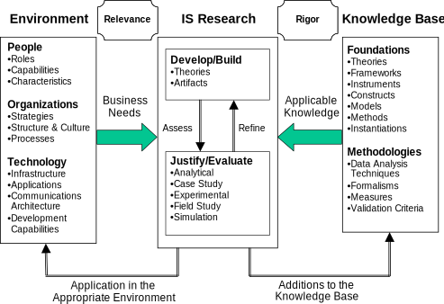

## Design science in information systems research

 <!-- Flo: good first note sheet. You can convert that into a 1-2 page intro of the methods section. Then you go on to show how you applied this framework, effectively proving that what you did is research, and not engineering.
 -->

methods = which subset of @HevnerDesignScienceInformation2004 et al i've used (?)

@HevnerDesignScienceInformation2004

Meta: COIN-Antrag hat das Paper hergenommen und interpretiert was das im Falle des konkreten Projektes bedeutet.

paper’s goal: how to conduct, evaluate and present design-science research

approaches from:

* **behavioral science**
  * roots in natural science?
  * analysis of people ↔ tech
  * field studies → phenomena in context
  * goal is “truth”
  * evaluated against norms of truth and explanatory power
  * methods: data collection and empirical analysis
  * predict or explain phenomena with respect to:
    * artifact’s use
    * perceived usefulness (intention to use)
    * impact on individuals and organizations (net benefits)
    * usually but not exclusively for instantiation
* **design science**
  * roots in engineering?
  * problem solving
  * changing phenomena that occur
  * creates and evaluates IT artifacts
  * problem-solution-space leaving freedom for style/expression/aesthetical choices
  * constructing to understand the problem
  * methods: “computational and mathematical @ quality and effectiveness of artifacts” (?) (what about User-tests of designs?)
  * fundamental questions
    * “What utility does the new artifact provide?”
    * “What demonstrates that utility?”
  * wicked problems (Brooks 1987, 1996; Rittel, Webber 1984)
    * unstable requirements, ill-defined environmental contexts
    * complex interactions among subcomponents of problem and solution
    * inherent flexibility to change design processes and artifacts
    * critical dependence on human cognitive abilities (e.g. creativity) for effective solutions
    * critical dep. … social abilities (e.g. teamwork) …
    * **{** js-client architecture as wicked problem? changing a lot but I assume best-practices will form as they did for server-side **}**
  * vs routine design:
    * routine: existing knowledge/best practices for organizational problems
    * routine: full-grown systems
    * research: unsolved problems in unique/innovative ways
    * research: solved problems but more effective/efficient
    * research: contribution to foundations and methodologies
    * research: requisite knowledge is non-existent

design and theory inform each other and point out each other’s short-comings via justify/evaluate-activity (p80)

implications of empirical IS research should be:

* implementable
* synthesize existing research
* or stimulate critical thinking among IS practitioners

technology and behavior are inseparable

Walls et al. (1992): design is both:

* process (set of activities)
* product (artifact)

March and Smith (1995):

* design processes
  * build/generate
  * evaluate
* design artifacts
  * constructs
    * vocabulary and symbols
    * provide language to define problems and solutions
    * <quote>“solving a problem simply means representing it so as to make the solution transparent.”</quote>  – Simon (1996, p. 132)
    * formal problem definition: difference between goal and current state with search process in-between
    * simplified/rough early, complex/well-fitting after design-iterations
  * models
    * abstractions and representations
    * represent real-world situation ~= design problem and solution space
    * aid problem/solution understanding
    * enable exploration of effects of design decisions
  * methods (algorithms and practices)
    * how to solve problem / search problem-space
  * instantiations (implemented and prototype systems)
    * demonstrate feasibility
    * enable assessment of artifacts suitability to its intended purpose

Rigor achieved by appropriately applying existing foundations and methodologies

### Design-Science Research Guidelines

1. **Design as an Artifact:** Design-science research must produce a viable artifact in the form of a construct, a model, a method, or an instantiation.
  * **demonstrates feasibility** (makes it research iff feasibility wasn’t clear to begin with)
  * can be in form of tools and frameworks
  * can demonstrate possibility to automate
  * “proof by construction” (Nunamaker 1991a)
  * **{** there’s a link to the github repo and a link to a running instance **}**
2. **Problem Relevance:** The objective of design-science research is to develop technology-based solutions to important and relevant business problems.
  * **{** the intensity of discussion and weight of businesses and speed of revolution/rate of new architectures being develop should attest to relevancy of the architectural challenge in js-client-application. Note: i need to quantify these claims. **}**
  * e.g. size of the affected economy, size of community, { number of affected projects, } …
    * **{** # of ng-based (and flux-based) projects on gh with at least same-sized code-base? **}**
    * **{** in general: also list problems other people had / experiences other people in the community had (qualitative analysis?) <!-- TODO find posts --> **}**
  * **Relevance** is with respect to a constituent community (e.g. IS practitioners)
  * **Technology Acceptance Model** short TAM (Venkatesh 2000)
    * **{** how did the acceptance among us programmers develop? worked okay-ish for our small team as it was relatively open (as long as it was js and relatively oop - purescript excluded). iterative/step-by-step acceptance due to incremental learning - now people are more open to typescript as we’ve already used a transpiler for es6 (that already was a bit of a learning process for all of us) **}**
  * Combination of artifacts for acceptance building:
    * technology-based (e.g. system conceptualizations, practices, technical capabilities, interfaces,…)
      * **{** made some diagrams that i used to explain the architecture to everyone **}**
    * organization-based (e.g. structures, reporting systems, social systems, …)
    * people-based (e.g. training, consensus building, …)
      * **{** we had a lunch-presentation on flux, which was strongly based on by FB, and personal walk-throughs, the latter mostly for fsu **}**
3. **Design Evaluation:** The utility, quality, and efficacy of a design artifact must be rigorously demonstrated via well-executed evaluation methods.
  * includes integration into infrastructure/usage context
    * **{** we definitely did that ^^ **}**
  * requires definition of appropriate metrics and gathering of appropriate data
    * **{** number of bug tickets? hours logged spent bug-fixing? anecdotal evidence of how difficult it is/was <!-- TODO decide on metrics and gather data --> **}**
  * provides feedback for iterations typical for design
  * for methods see “Design Evaluation Methods” below
  * **{** compare examples of same process in old and new prototype (e.g. authoring and chatting (including unread?)) <!-- TODO pick examples and extract code --> **}**
    * **{** has bias due to learning advantage the second time around **}**
      * **{** redesign some processes with proper MVC and optionally Flux for comparison. **}**
    * **{** title?: ‘going from angular “MVC” to redux for a messaging-based app’}
  * evaluate in terms of:
    * functionality
    * completeness
      * **{** it does everything we’ve needed so far – network, push-notifs, persistence (soon), live-updates (i.o. at page-reload), etc. not the best argument though.  **}**
    * consistency
      * **{** not many changes to vanilla redux (mostly ways to deal with ws and rdfstore-caching) – consistent with expectations. still needs devs to keep logic as far as possible in the pure reducers and don’t have async ACs call each other. otherwise they result is redundant code in comps or murky causality madness among ACs.  **}**
    * accuracy
    * performance
    * reliability
      * **{** reduced bugs / bugs that are easier to find? **}**
      * **{** immutable-js gives us nice guarantee that data won’t change after passing it on **}**
    * usability
      * **{** unified state object in redux is much more straight-forward than flux-stores or angular services (not evaluated though) **}**
      * **{** es6, immutable-js and redux all had their learning curves. I assume that redux is still easier to learn and especially learn to use well than angular 1.x **}**
    * fit with the organization
      * **{** separation of concerns allows mocking. **}**
      * **{** it fits our needs for a js-client architecture. it should be relatively easy to learn / start working even when not everything is understood into finest detail **}**
      * **{** it should also working in a somewhat larger team. no idea how well it works with >10 developers. it doesn’t offer special advantages to small teams though as far as I can tell (except that it’s more lightweight than flux. angular is just a bad idea except for the smallest of examples) **}**
    * other relevant quality attributes
      * **{** transparency of program flow and causal dependencies **}**
      * **{** separation of concerns **}**
      * **{** maintainability **}**
      * **{** scalability **}**
        * **{** e.g. graph-visualization of the app with one and many process implemented **}**
4. **Research Contributions:** Effective design-science research must provide clear and verifiable contributions in the areas of the design artifact, design foundations, and/or design methodologies.
  * **{** <!-- TODO architecture graphics -->  **}**
  * **{** e.g. how to deal with web sockets in redux? **}**
  * **{** e.g. how to integrate rdf-store? **}**
  * **{** e.g. how to do this without switching to React **}**
  * **{** afaict most arguments are purely developer experience. if i can make a nice dependency graph or something more representative, it would have that contribution of rigorosity in argument when to use this setup/architecture and when not to **}**
  * **{** auto-ethnographic case-study with these two frameworks and the migration between them **}**
  * novelty, generality, significance of artifact
    * **{** the most “novel” thing probably is that we don’t use react. Then again, someone has written the ng-redux that we’re using. It was novel for our studio, if that counts. **}**
    * **{** generality, yes. It should perform well for apps with a lot of client side interactivity. Theoretically everything can be expressed within the framework, but for apps that are only thin views over static data server-side solutions or frameworks like FB’s Relay might be easier to use. **}**
    * **{** significance: well, the project would have been a lot more work to build and maintain without a clean architecture with good separation of concern and clear causality. Many js-client projects could benefit from using a similar architecture. Especially those that work with frameworks that use local state. **}**
  * assessed via representational fidelity and implementability
    * **{** represented environment: SAT, our team, our workflow. how does the work represent it? the work-splitting allowed to thank to mock-ability? Is it especially suited to small teams and iterations? there’s some setup effort involved over vanilla js. vanilla js becomes unusable quickly even for single-person projects though.  **}**
  * artifact should extend knowledge-base or use previous knowledge in new and innovative ways
    **{** no-one did this with an rdfstore before, as far as I found out <!-- TODO re-research that to be up-to-date --> **}**
      * **{** then again, for our intents and purposes it fulfills the role of web-api-utils that the [flux documentation mentions](https://github.com/facebook/flux#flux) (by now) **}**
  * contributions to foundations extend knowledge-base
  * methodologies: evaluation methods and metrics (e.g. TAM)
5. **Research Rigor:** Design-science research relies upon the application of rigorous methods in both the construction and evaluation of the design artifact.
  * over-emphasis on rigor often results in lower relevance (Lee 1999) {e.g. positivism}
    * **{** not a problem we’ll have ^^ **}**
  * environments and artifacts might defy excessive formalism
  * rigor is derived from the effective use of the knowledge-base
    * **{** knowledge derived from personal environment and reading up-to-date resources (mostly blogs and conference-talks) **}**
    * **{** flux is seems to be widely used by FB, redux is a simplification on that. wasn’t there also an endorsement for redux by one of flux’ authors? **}**
      * “Love what you're doing with Redux” - Jing Chen, creator of Flux
      * “I asked for comments on Redux in FB's internal JS discussion group, and it was universally praised. Really awesome work.” - Bill Fisher, author of Flux documentation
      * “It's cool that you are inventing a better Flux by not doing Flux at all.” - André Staltz, creator of Cycle
      * **{** <quote>Awesome talk @dan_abramov, love what you're doing with Redux! #reacteurope</quote> - Jing Chen (creator of flux) source: <https://twitter.com/jingc/status/616608251463909376> via <https://github.com/reactjs/redux#testimonials> **}**
    * **{** Elm has been developing a similar architecture for a while and afair flux was strongly inspired by elm **}**
      * **{** of flux developed independently and redux was an iteration that was inspired by frp libs (elm?)**}**
      * **{** <quote>...Redux evolves the ideas of Flux, but avoids its complexity by taking cues from Elm. </quote>, source: <https://github.com/reactjs/redux#influences> **}**
  * construction of effective metrics
  * “human-machine problem-solving-systems” → behavioral theories and empirical work
  * understand why an artifact works or doesn’t work
6. **Design as a Search Process:** The search for an effective artifact requires utilizing available means to reach desired ends while satisfying laws in the problem environment.
  * **heuristic search** strategies
    * **{** we tried a few alternatives and went for what seemed simpler and cleaner **}**
  * **generate/test**-cycle {~hci/ux/usability-pm-cycle}
    * **{** we somewhat tested the usability of the prototype, but (how) did we evaluate the architecture? did we iterate? not really **}**
    * **{** otherwise we evolved the architecture when it became necessary (by order of backlog) / we found something that it couldn’t do **}**
  * **problem solving:** utilizing available means → desired ends + satisfying laws in environment
    * often not possible to determine, let alone explicitly describe due to **wicked** nature (Vessey and Glass 199)
  * often simplifies to subset of problems/simpler sub-problems
    * **{** where did we start with the changes/refactoring? i assume it was drafts/create-post or something like routing. <!-- TODO dive github versions --> **}**
    * more realistic → more relevant
  * searching for a satisfactory solution, instead of explicitly specifying all possible solutions
  * often unclear why it works / the extend of its generalizability .
  * establish if it does work and in which environments
    * what constitutes “working” and “good”? which metrics?
      * **{** in what way is our current architecture better fitted? incl migration effort vs budget limits. what else might we want to try? <!-- TODO ponder --> **}**
    * compare with other solutions for the same problem by human experts
      * **{** compare to other architectures/setups <!-- TODO ponder --> **}**
    * **{** when to and when not to use this architecture? it comes with a lot of overhead in setup, code and learning curve. e.g. for Quadex’s problem angular 2 was the better tool <!-- TODO ponder --> **}**
7. **Communication of Research:** Design-science research must be presented effectively both to technology-oriented as well as management-oriented audiences.
  * @ technology-oriented: construction and evaluation process { to allow reproduction }
    **{** this thesis + hopefully some improved docu soon™ **}**
  * @ management-oriented:
    * { answer “is it worth the effort for my business?” } <!-- TODO talk this over with flo. can we find metrics for that? -->
    * required knowledge / {“who can use it?”}
      * **{** es6? (doable without/easy from es5), value of pure functions?, immutable-js, scss (easy from css), how to install npm, sadly a lot of angular concepts (e.g. how it’s module system  works) **}**
    * importance of problem
    * effectiveness of solution
    * some detail in appendices that allow some understanding/appreciation

The guidelines are not mandatory / to be used as rote, but should all be addressed.

### Design Evaluation Methods

1. **Observational**
  * **Case Study:** Study artifact in depth in business environment
    * **{** ^ that **}**
    * **{** anecdotal evidence by fsu/fk/sbyim/yp how they feel about it? (super-biased due to interaction with me) **}**
  * **Field Study:** Monitor use of artifact in multiple projects
    * **{** the meinkauf app! what did we use there? ionic and vanilla angular or ng-redux too? <!-- TODO get copy of mk repo --> **}**
2. **Analytical**
  * **Static Analysis:** Examine structure of artifact for static qualities (e.g., complexity)
    * **{** graph out dependencies in both apps, if necessary in one vertical slice of one process <!-- TODO make graph of dependencies -->  **}**
    * **{** code-examples of very simple apps with both architectures to demonstrate boiler-plate / overhead? Todo-MVC? <!-- TODO write examples -->  **}**
  * **Architecture Analysis:** Study fit of artifact into technical IS architecture
    * **{** analyze how well it interacts with the rest of the WoN-ecosystem. what defines “interacts well”? <!-- TODO ponder --> **}**
  * **Optimization:** Demonstrate inherent optimal properties of artifact or provide optimality bounds on artifact behavior
  * **Dynamic Analysis:** Study artifact in use for dynamic qualities (e.g., performance)
3. **Experimental Controlled Experiment:**
  * Study artifact in controlled environment for qualities (e.g., usability)
4. **Testing Functional (Black Box) Testing:**
  * **Execute artifact** interfaces to discover failures and identify defects Simulation – Execute artifact with artificial data
  * **Structural (White Box) Testing:** Perform coverage testing of some metric
(e.g., execution paths) in the artifact implementation
5. **Descriptive**
  * **Informed Argument:** Use information from the knowledge base (e.g., relevant research) to build a convincing argument for the artifact’s utility
    * **{** ^ this **}**
    * (only) usable for more innovative artifacts for which other methods aren’t feasible
  * **Scenarios:** Construct detailed scenarios around the artifact to demonstrate its utility
