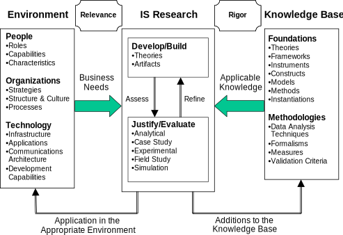

## Design science in information systems research

 <!-- Flo: good first note sheet. You can convert that into a 1-2 page intro of the methods section. Then you go on to show how you applied this framework, effectively proving that what you did is research, and not engineering.
 -->

methods = which subset of @HevnerDesignScienceInformation2004 et al i've used (?)

@HevnerDesignScienceInformation2004

Meta: COIN-Antrag hat das Paper hergenommen und interpretiert was das im Falle des konkreten Projektes bedeutet.

paper’s goal: how to conduct, evaluate and present design-science research

approaches from:

* **behavioral science**
  * roots in natural science?
  * **analysis** of people ↔ tech
  * field studies → phenomena in context
  * goal is “truth”
  * evaluated against norms of truth and explanatory power
  * methods: data collection and empirical analysis
  * **predict or explain** phenomena with respect to:
    * artifact’s use
    * perceived usefulness (intention to use)
    * impact on individuals and organizations (net benefits)
    * usually but not exclusively for instantiation
* **design science**
  * roots in engineering?
  * **problem solving**
  * changing phenomena that occur
  * creates and evaluates IT artifacts
  * problem-solution-space leaving freedom for style/expression/aesthetical choices
  * **constructing to understand** the problem
  * methods: “computational and mathematical @ quality and effectiveness of artifacts” (?) (what about User-tests of designs?)
  * **fundamental questions**
    * “What utility does the new artifact provide?”
    * “What demonstrates that utility?”
  * **wicked problems** (Brooks 1987, 1996; Rittel, Webber 1984)
    * unstable requirements, ill-defined environmental contexts
    * complex interactions among subcomponents of problem and solution
    * inherent flexibility to change design processes and artifacts
    * critical dependence on human cognitive abilities (e.g. creativity) for effective solutions
    * critical dep. … social abilities (e.g. teamwork) …
  * **vs routine design:**
    * routine: existing knowledge/best practices for organizational problems
    * routine: full-grown systems
    * research: unsolved problems in unique/innovative ways
    * research: solved problems but more effective/efficient
    * research: contribution to foundations and methodologies
    * research: requisite knowledge is non-existent

**design and theory** inform each other and point out each other’s short-comings via justify/evaluate-activity (p80)

implications of empirical IS research should be:

* implementable
* synthesize existing research
* or stimulate critical thinking among IS practitioners

technology and behavior are inseparable

Walls et al. (1992): design is both:

* process (set of activities)
* product (artifact)

March and Smith (1995):

* **design processes**
  * build/generate
  * evaluate
* **design artifacts**
  * **constructs**
    * vocabulary and symbols
    * provide language to define problems and solutions
    * <quote>“solving a problem simply means representing it so as to make the solution transparent.”</quote>  – Simon (1996, p. 132)
    * formal problem definition: difference between goal and current state with search process in-between
    * simplified/rough early, complex/well-fitting after design-iterations
  * **models**
    * abstractions and representations
    * represent real-world situation ~= design problem and solution space
    * aid problem/solution understanding
    * enable exploration of effects of design decisions
  * **methods** (algorithms and practices)
    * how to solve problem / search problem-space
  * **instantiations** (implemented and prototype systems)
    * demonstrate feasibility
    * enable assessment of artifacts suitability to its intended purpose

### Design-Science Research Guidelines

The guidelines are not mandatory / to be used as rote, but should all be addressed.

1. **Design as an Artifact:** Design-science research must produce a viable artifact in the form of a construct, a model, a method, or an instantiation.
  * **demonstrates feasibility** (makes it research iff feasibility wasn’t clear to begin with)
  * can be in form of tools and frameworks
  * can demonstrate possibility to automate
  * “proof by construction” (Nunamaker 1991a)
2. **Problem Relevance:** The objective of design-science research is to develop technology-based solutions to important and relevant business problems.
  * e.g. size of the affected economy, size of community, { number of affected projects, } …
  * **Relevance** is with respect to a constituent community (e.g. IS practitioners)
  * **Technology Acceptance Model** short TAM (@VenkateshTheoreticalExtensionTechnology2000 and @VenkateshDeterminantsPerceivedEase2000)
  * Combination of artifacts for acceptance building:
    * technology-based (e.g. system conceptualizations, practices, technical capabilities, interfaces,…)
    * organization-based (e.g. structures, reporting systems, social systems, …)
    * people-based (e.g. training, consensus building, …)
3. **Design Evaluation:** The utility, quality, and efficacy of a design artifact must be rigorously demonstrated via well-executed evaluation methods.
  * **includes integration** into infrastructure/usage context
  * requires definition of appropriate **metrics** and gathering of appropriate **data**
  * provides feedback for iterations typical for design
  * establish if it does work and in which environments
    * what constitutes “working” and “good”? which metrics?
    * compare with other solutions for the same problem by human experts
  * for methods see “Design Evaluation Methods” below
  * evaluate in terms of:
    * functionality
    * completeness
    * consistency
    * accuracy
    * performance
    * reliability
    * usability
    * fit with the organization
    * other relevant quality attributes
4. **Research Contributions:** Effective design-science research must provide clear and verifiable contributions in the areas of the design artifact, design foundations, and/or design methodologies.
  * Rigor achieved by appropriately applying existing foundations and methodologies
  * **novelty, generality, significance** of artifact
  * assessed via representational fidelity and implementability
  * artifact should extend knowledge-base or use previous knowledge in new and innovative ways
  * contributions to foundations extend knowledge-base
  * methodologies: evaluation methods and metrics (e.g. TAM)
5. **Research Rigor:** Design-science research relies upon the application of rigorous methods in both the construction and evaluation of the design artifact.
  * **over-emphasis** on rigor often results in lower relevance (Lee 1999) {e.g. positivism}
  * environments and artifacts might **defy excessive formalism**
  * rigor is derived from the effective use of the knowledge-base
  * construction of effective metrics
  * “human-machine problem-solving-systems” → behavioral theories and empirical work
  * understand why an artifact works or doesn’t work
6. **Design as a Search Process:** The search for an effective artifact requires utilizing available means to reach desired ends while satisfying laws in the problem environment.
  * **heuristic search** strategies
  * **generate/test**-cycle {~hci/ux/usability-pm-cycle}
  * often not possible to determine, let alone explicitly describe relevant means, ends, or laws due to **wicked** nature (Vessey and Glass 199)
  * often simplifies to subset of problems/simpler **sub-problems**
    * more realistic → more relevant
  * searching for a satisfactory solution, instead of explicitly specifying all possible solutions
  * often unclear why it works / the extend of its generalizability .
7. **Communication of Research:** Design-science research must be presented effectively both to technology-oriented as well as management-oriented audiences.
  * @ technology-oriented: construction and evaluation process { to allow reproduction }
  * @ management-oriented:
    * { answer “is it worth the effort for my business?” } <!-- TODO talk this over with flo. can we find metrics for that? -->
    * required knowledge / {“who can use it?”}
    * importance of problem
    * effectiveness of solution
    * some detail in appendices that allow some understanding/appreciation

### Design Evaluation Methods

1. **Observational**
  * **Case Study:** Study artifact in depth in business environment
  * **Field Study:** Monitor use of artifact in multiple projects
2. **Analytical**
  * **Static Analysis:** Examine structure of artifact for static qualities (e.g., complexity)
  * **Architecture Analysis:** Study fit of artifact into technical IS architecture
  * **Optimization:** Demonstrate inherent optimal properties of artifact or provide optimality bounds on artifact behavior
  * **Dynamic Analysis:** Study artifact in use for dynamic qualities (e.g., performance)
3. **Experimental**
  * **Controlled Experiment** Study artifact in controlled environment for qualities (e.g., usability)
  * **Simulation** Execute artifact with artificial data
4. **Testing**
  * **Functional (Black Box) Testing:** Execute artifact interfaces to discover failures and identify defects
  * **Structural (White Box) Testing:** Perform coverage testing of some metric (e.g., execution paths) in the artifact implementation
5. **Descriptive**
  * **Informed Argument:** Use information from the knowledge base (e.g., relevant research) to build a convincing argument for the artifact’s utility
    * (only) usable for more innovative artifacts for which other methods aren’t feasible
  * **Scenarios:** Construct detailed scenarios around the artifact to demonstrate its utility
